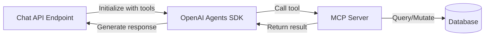

# MCP Tools Specification

## Overview

The MCP (Model Context Protocol) server exposes stateless tools that allow the OpenAI Agent to perform CRUD operations on tasks. All tools operate within the context of an authenticated user.

## Architecture

### MCP Server

- **Framework**: Official MCP SDK for Python
- **Location**: `backend/src/mcp/server.py`
- **Purpose**: Expose task management operations as tools for AI agent
- **Database**: Direct access to Neon PostgreSQL via SQLModel
- **Stateless**: No session state; all context from parameters

### Integration with OpenAI Agents SDK



## Tool Definitions

### 1. add_task

**Purpose**: Create a new task for the user

**Parameters**:
- `user_id` (string, required): User identifier from JWT token
- `title` (string, required): Task title (max 200 chars)
- `description` (string, optional): Task description (max 1000 chars)

**Returns**:
```json
{
  "success": true,
  "task_id": 123,
  "title": "Buy milk",
  "message": "Task created successfully"
}
```

**Error Handling**:
- Empty title → Return error with user-friendly message
- Database error → Return error with generic message (log details)

**Implementation**:
```python
def add_task(user_id: str, title: str, description: str = None) -> dict:
    # Validate inputs
    # Create Task model instance
    # Save to database
    # Return success response
```

---

### 2. list_tasks

**Purpose**: Retrieve user's tasks with optional filtering

**Parameters**:
- `user_id` (string, required): User identifier from JWT token
- `status` (string, optional): Filter by status
  - `"all"` (default): Return all tasks
  - `"pending"`: Return only incomplete tasks (`completed=False`)
  - `"completed"`: Return only completed tasks (`completed=True`)

**Returns**:
```json
{
  "success": true,
  "count": 3,
  "tasks": [
    {
      "id": 1,
      "title": "Buy milk",
      "description": "Get 2% milk from store",
      "completed": false,
      "created_at": "2026-02-05T10:00:00Z"
    },
    // ... more tasks
  ]
}
```

**Error Handling**:
- Invalid status value → Default to "all"
- Database error → Return error message

**Implementation**:
```python
def list_tasks(user_id: str, status: str = "all") -> dict:
    # Build query filtered by user_id
    # Apply status filter if specified
    # Order by created_at desc
    # Return formatted task list
```

---

### 3. complete_task

**Purpose**: Mark a task as completed

**Parameters**:
- `user_id` (string, required): User identifier from JWT token
- `task_id` (integer, required): ID of task to complete

**Returns**:
```json
{
  "success": true,
  "task_id": 5,
  "title": "Buy milk",
  "completed": true,
  "message": "Task marked as completed"
}
```

**Error Handling**:
- Task not found → Return error "Task not found"
- Task belongs to different user → Return error "Task not found" (security)
- Already completed → Return success (idempotent)

**Implementation**:
```python
def complete_task(user_id: str, task_id: int) -> dict:
    # Find task by id AND user_id
    # If not found, return error
    # Set completed=True
    # Update updated_at timestamp
    # Save to database
    # Return success response
```

---

### 4. delete_task

**Purpose**: Delete a task permanently

**Parameters**:
- `user_id` (string, required): User identifier from JWT token
- `task_id` (integer, required): ID of task to delete

**Returns**:
```json
{
  "success": true,
  "task_id": 7,
  "message": "Task deleted successfully"
}
```

**Error Handling**:
- Task not found → Return error "Task not found"
- Task belongs to different user → Return error "Task not found" (security)
- Database error → Return error message

**Implementation**:
```python
def delete_task(user_id: str, task_id: int) -> dict:
    # Find task by id AND user_id
    # If not found, return error
    # Delete from database
    # Return success response
```

---

### 5. update_task

**Purpose**: Update task title and/or description

**Parameters**:
- `user_id` (string, required): User identifier from JWT token
- `task_id` (integer, required): ID of task to update
- `title` (string, optional): New task title
- `description` (string, optional): New task description

**Returns**:
```json
{
  "success": true,
  "task_id": 3,
  "title": "Updated title",
  "description": "Updated description",
  "message": "Task updated successfully"
}
```

**Error Handling**:
- Task not found → Return error "Task not found"
- Task belongs to different user → Return error "Task not found" (security)
- No fields provided → Return error "No fields to update"
- Database error → Return error message

**Implementation**:
```python
def update_task(user_id: str, task_id: int, title: str = None, description: str = None) -> dict:
    # Find task by id AND user_id
    # If not found, return error
    # If no fields provided, return error
    # Update provided fields
    # Update updated_at timestamp
    # Save to database
    # Return success response
```

## Security Requirements

### User Isolation

> [!CAUTION]
> **CRITICAL**: Every tool MUST filter database queries by `user_id` to prevent unauthorized access to other users' tasks.

**Bad** ❌:
```python
task = session.query(Task).filter(Task.id == task_id).first()
```

**Good** ✅:
```python
task = session.query(Task).filter(
    Task.id == task_id,
    Task.user_id == user_id
).first()
```

### Input Validation

- Validate all user inputs before database operations
- Sanitize string inputs (SQLModel handles SQL injection)
- Enforce length limits on title/description
- Validate task_id is positive integer

### Error Messages

- **Never** expose internal errors to agent
- Use generic messages for security errors
- Log detailed errors server-side for debugging

## Response Format

All tools return a consistent dictionary format:

**Success Response**:
```python
{
    "success": True,
    "message": "Human-readable success message",
    # ... additional data fields
}
```

**Error Response**:
```python
{
    "success": False,
    "error": "Human-readable error message"
}
```

## Testing Requirements

### Unit Tests

Each tool must have unit tests covering:
- ✅ Successful operation
- ✅ Invalid inputs
- ✅ Task not found
- ✅ Wrong user access (security)
- ✅ Database errors

### Integration Tests

- ✅ MCP server initialization
- ✅ Tool registration with OpenAI Agent
- ✅ End-to-end tool execution
- ✅ Concurrent requests

## Performance Considerations

- **Database Indexes**: Ensure `user_id` is indexed on `tasks` table
- **Query Optimization**: Use selective queries (limit columns if needed)
- **Connection Pooling**: Reuse database connections (handled by SQLModel)
- **Timeout**: Set reasonable timeout for tool execution (e.g., 5 seconds)

## Implementation Notes

### Dependencies

```txt
mcp>=1.0.0  # Official MCP SDK
sqlmodel>=0.0.14
psycopg2-binary>=2.9.9  # PostgreSQL adapter
```

### File Structure

```
backend/src/mcp/
├── __init__.py
├── server.py       # MCP server initialization
├── tools.py        # Tool implementations
└── schemas.py      # Tool parameter/response schemas
```

### Registration with Agent

```python
from mcp import MCPServer
from openai_agents import Agent

# Initialize MCP server
mcp_server = MCPServer()

# Register tools
mcp_server.register_tool("add_task", add_task)
mcp_server.register_tool("list_tasks", list_tasks)
# ... register other tools

# Initialize OpenAI Agent with MCP tools
agent = Agent(
    name="Todo Assistant",
    model="gpt-4",
    tools=mcp_server.get_tools()
)
```