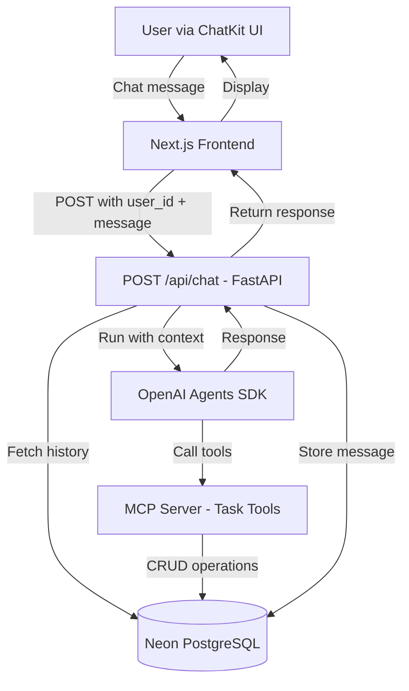

# Feature: AI-Powered Todo Chatbot

## Overview

Transform the Todo application into a conversational interface where users can manage tasks through natural language using an AI agent powered by OpenAI Agents SDK and Model Context Protocol (MCP).

## Architecture

### Components



### Data Flow

1. **User sends message** → Frontend (OpenAI ChatKit)
2. **Frontend sends request** → `POST /api/chat` with `user_id` and `message`
3. **Backend fetches context** → Load conversation history from `messages` table
4. **Run AI agent** → OpenAI Agents SDK processes message with MCP tools
5. **Agent executes tools** → MCP server performs database operations
6. **Store response** → Save assistant's reply to `messages` table
7. **Return to frontend** → Display response in chat interface

## User Stories

### Core Functionality
- As a user, I can say **"Add a task to buy milk"** and the agent creates a new task
- As a user, I can ask **"What are my pending tasks?"** and see a formatted list
- As a user, I can say **"Mark task 5 as completed"** and the status updates
- As a user, I can say **"Delete task 3"** and the task is removed
- As a user, I can say **"Update task 2 title to 'Grocery shopping'"** and the task is modified

### Conversational Features
- As a user, I receive friendly confirmations for every action
- As a user, I can ask follow-up questions in natural language
- As a user, my conversation history persists across sessions
- As a user, I receive helpful error messages when operations fail

## Technical Requirements

### Backend

#### MCP Server
- **Location**: `backend/src/mcp/server.py`
- **SDK**: Official MCP SDK for Python
- **Tools**: Expose 5 stateless tools (see `specs/api/mcp-tools.md`)
- **Database**: Direct access to Neon PostgreSQL via SQLModel
- **Authentication**: Each tool receives `user_id` parameter for scoping

#### Chat API Endpoint
- **Route**: `POST /api/chat`
- **Authentication**: Required (JWT token verification)
- **Request Body**:
  ```json
  {
    "message": "string",
    "conversation_id": "optional-uuid"
  }
  ```
- **Response**:
  ```json
  {
    "response": "string",
    "conversation_id": "uuid"
  }
  ```

#### Database Models
Two new tables required (see `specs/database/schema.md`):
- `conversations` - Store conversation metadata
- `messages` - Store individual chat messages

#### Stateless Request Cycle
- Fetch full conversation history from database
- Pass to OpenAI Agent as context
- Store new messages after agent responds
- No in-memory session state

### Frontend

#### UI Framework
- **Library**: OpenAI ChatKit
- **Integration**: Embed in existing Next.js dashboard
- **Authentication**: Pass JWT token from Better Auth

#### Configuration
- **Domain Allowlist**: Configure for production deployment
- **API Endpoint**: `/api/chat` (proxied through Next.js)
- **User Context**: Include `user_id` with all requests

## Acceptance Criteria

### Functionality
- [ ] Agent successfully creates tasks via natural language
- [ ] Agent lists tasks filtered by status (all/pending/completed)
- [ ] Agent marks tasks as completed
- [ ] Agent deletes tasks
- [ ] Agent updates task title and description

### Quality
- [ ] MCP tools are stateless and receive `user_id` parameter
- [ ] Server fetches conversation history from database each request
- [ ] Agent provides friendly, conversational confirmations
- [ ] Error handling with user-friendly messages
- [ ] User can only access their own tasks (enforced by `user_id`)

### Integration
- [ ] ChatKit UI integrated into Next.js dashboard
- [ ] JWT authentication properly passed to backend
- [ ] Conversation history persists in database
- [ ] Frontend displays responses in real-time

## Security Considerations

- **User Isolation**: All MCP tools MUST filter by `user_id`
- **Token Validation**: Chat API must verify JWT before processing
- **SQL Injection**: Use parameterized queries (SQLModel handles this)
- **Data Leakage**: Never expose other users' tasks or conversations

## Performance Considerations

- **Database Queries**: Index `user_id` and `conversation_id` columns
- **Conversation History**: Limit to last N messages (e.g., 50)
- **Response Time**: Target < 3 seconds for typical requests
- **Caching**: Optional - cache recent conversations (Phase 4)

## Future Enhancements (Out of Scope)

- Streaming responses
- Voice input/output
- Task prioritization and scheduling
- Collaborative tasks
- Advanced natural language understanding